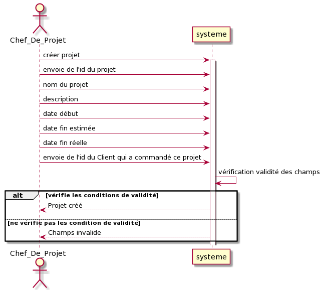
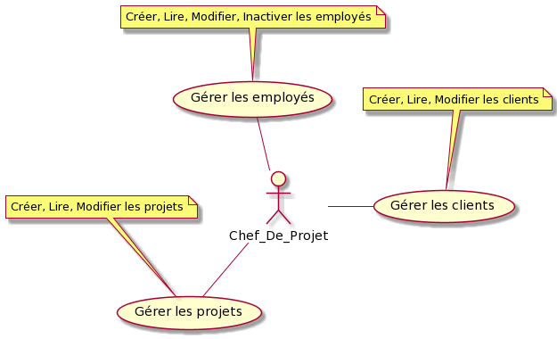

= *Cahier de charges - v1*
:toc: macro
:toc-title: Sommaire
:numbered:
:icons: font

27/05/2021

image:media/logoIUT.png[IUT]

Université Toulouse 2 - Jean Jaurès

IUT de Blagnac

DUT INFO S2/Module PTUT

:company: RHESN

Membres : 

- `DUFRECHOU Florian` 
- `ONEDA Mathis` 
- `SEBAICI Kelian` 
- `VOVC Dan-Gabriel`
- `ZHU Xuxin`

toc::[]

== Introduction

La société “PTUTG5” est une entreprise de services numériques située à Blagnac depuis 2021. Elle souhaite répondre aux besoins informatiques d’autres entreprises. PTUTG5 s’engage dans la conception et la réalisation des applications de gestion numériques afin de faciliter la gestion des tâches, des clients, des fournisseurs, des employés d’une entreprise.

La société "DevExpert" souhaite être aidée par la société “PTUTG5” afin d'améliorer leur outil de gestion des ressources humaines permettant aux chefs de projet d’avoir un suivi global sur leurs projets, clients et employés. L'équipe “DevExpert” utilisait une application assez élémentaire qui ne leur permettait pas d’aboutir à un suivi de gestion précis. La société “PTUTG5” chargera de concevoir et réaliser des nouvelles mises à jour des outils précis automatisés de gestion des ressources humaines dans le cadre de leur entreprise sur l’application qui l’ont déjà créée.

== Analyse de l’existant

La société "DevExpert" avait conçu un prototype d’application qui leur permet seulement d’enregistrer un nouvel employé dans la base de données, de consulter ses informations ou même de les modifier. Il existe aussi l’option d’inactiver un employé afin de garder une trace des Ressources Humaines mobilisées sur des projets achevés; de ce fait, un employé n’est pas supprimé de la base mais rendu inactif.

Ces options ne sont pas suffisantes afin de rendre l’application utilisable dans le contexte souhaité.

== Analyse des besoins

L’application doit permettre aux chefs de projet d’ajouter des nouveaux clients et projets dans la base de données. Les chefs de projet peuvent ensuite consulter et modifier les informations de n’importe quel client (son id, son nom, son email, son téléphone etc.). En plus, il peut aussi rendre inactif un client (on les garde en mémoire dans la base) afin de garder une trace de clients antécédents pour des RH mobilisées sur des projets achevés.

L’application doit donner accès ensuite aussi au fait d’ajouter un projet (nom du projet, date de début, client référentiel etc.) dans la base de données. Le chef de projet peut consulter n’importe quel projet de l’entreprise, peu importe les projets qu’il pilote. Pourtant, il peut seulement modifier les projets dont il a été désigné. Ensuite, le chef de projet peut rendre inactif un projet afin de garder en mémoire tous les projets finis.

== Objectifs du logiciel

L’objectif du logiciel est de rendre plus facile aux chefs de projet de gérer l’ensemble de ses clients et ses employés rattachés à un projet. Ils peuvent créer des projets et les attribuer aux employés pour les développer. Les chefs de projets peuvent ensuite suivre les avancements des projets afin d’avoir une vue globale sur l’ensemble de l’entreprise.

== La description de la solution

La solution est basée sur la conception et réalisation des nouvelles fonctionnalités implémentées dans l’application déjà fournie.

=== Diagramme de séquence "Créer un projet”

Réalisation d’une diagramme de séquence qui permet au acteur chef de projet de créer un projet dans le acteur système en donnant comme informations l’id du projet, le nom du projet, la description du projet, la date début du projet, la date fin estimée du projet, la date fin réelle maximale du projet, et l’envoie de l’id d’un Client référant à ce projet (on garde le champs null si aucun client n’appartient au projet). L’acteur système vérifie les conditions de validité de tous les champs insérés par le chef de projet. Dans le cas où il n’y a pas d’erreur, le système confirme l’inscription du nouveau projet, sinon, le système demande de corriger les erreurs.

=== Diagramme de séquence "Créer un client”

Réalisation d’une diagramme de séquence qui permet au acteur Chef_De_Projet de créer un nouveau client dans l’acteur système en donnant comme informations l’id du client, le nom du client,, l’adresse email du client, le téléphone du client, l’entreprise du client, l’envoie de l’id du d’un projet référant à ce client (on garde le champs null si aucun projet n’appartient au client). Le système vérifie les conditions de validité de tous les champs insérés par le chef de projet. Dans le cas où il n’y a pas d’erreur, le système confirme l’inscription du nouveau client, sinon, le système demande de corriger les erreurs.

image:Diagrammes_sequence-v1/UC_creer_client_img.png[UC_creer_client]

NOTE: Avec ces nouvelles fonctionnalités, l’application aura comme représentation cette nouvelle diagramme de cas d’utilisation.

=== Diagramme de cas d’utilisation de l’application

Réalisation de cas d’utilisation de l’application avec un acteur Chef_De_Projet qui lui permet de gérer les employés (Créer, Lire, Modifier, Inactiver), gérer les clients (Créer, Lire, Modifier) et gérer les projets (Créer, Lire, Modifier).

== Analyse des contraintes

=== Contraintes Organisationnelles

Le projet débute le 25 Mai 2021 à 9:30 et se termine le 4 Juin 2021. Nous répartissons le temps en 9h de présentiel et 15h de distanciel pour un temps total de travail de 24h. Nous avons aussi des contraintes de dépôt. Toutes les tâches doivent être planifiées, saisies et mises à jour. +

[options=header]
|===
| Date    | Nom         
| 25/05   | Gantt V1      
| 26/05   | Cahier des charges V1       
|         | Gantt V1-2   
| 27/05   | Cahier des charges V1 final  
|         | Gantt V1-3  
| 28/05   | Cahier des charges V2 final     
|         | Gantt V2                         
|         | Documentation Utilisateur V1                     
|         | Documentation Technique V1                       
|         | Code sql et java V1                          
|         | Recette V1                         
|         | Gantt V2                          
|         | `jar` projet     
| 31/05   | Gantt V2-1           
| 01/06   | Documentation Utilisateur V2                       
|         | Documentation Technique V2                       
|         | Code sql et java V2                           
|         | Recette V2                        
|         | Gantt V2-3                          
|         | `jar` projet    
| 02/06   | Gantt V3-1          
| 03/06   | Documentation Utilisateur V3                      
|         | Documentation Technique V3                      
|         | Code sql et java V3                            
|         | Recette V3                       
|         | Gantt V3-2                          
|         | `jar` projet     
|===

Ainsi, chaque membre de l’équipe est chargé d’un rôle dont les tâches sont bien précisées.

DUFRECHOU Laurian : 

- Développeur SQL sur la création d’un client
- Administrateur base de données sur SQL Developer
- Conception diagramme de séquence "Créer un projet”

ONEDA Mathis :

- Développeur Java sur la création d’un projet
- Developpeur Java de l’interface machine-homme

SEBAICI Kelian :

- Chef de projet; maintient et assure la continuité et le développement du projet de manière organique
- Gestionnaire des tâches; création du gantt
- Développeur SQL sur la création d’un projet

VOVC Dan-Gabriel :

- Rédacteur cahier de charges
- Rédacteur documentation technique
- Conception diagramme de séquence "Créer un client”

ZHU Xuxin :

- Développeur Java sur la création d’un client
- Testeur sur les erreurs potentielles du programme
- Rédacteur documentation utilisateur

=== Contraintes techniques

Pour réaliser ce projet, nous utilisons :

- Oracle SQL Developer afin de créer et configurer une base de données qui stocke toutes les informations
- Eclipse afin de développer le programme dans le langage Java et faire la liaison avec la base de donnees

L’application doit entièrement fonctionner à partir d’un .jar exécutable et son déploiement se fera sur les postes de travail des chefs de projet.

== Conclusion 

Grâce à cet outil, la société “DevExpert” pourra garantir un suivi fiable de la globalité des projets au sein de ses employeurs en sachant aussi les détailles de leur clients et leur employés. Les chefs de projets auront ces tâches facilités grâce à ce dispositif simple d’utilisation. Par la suite, il sera possible d'implémenter plusieurs fonctionnalités afin de mieux personnaliser le logiciel.

= Fichiers complementaires

link:Cahier-de-Charges-v1/Cahier_de_Charges_v1.pdf[Cahier de Charges VERSION PDF]
