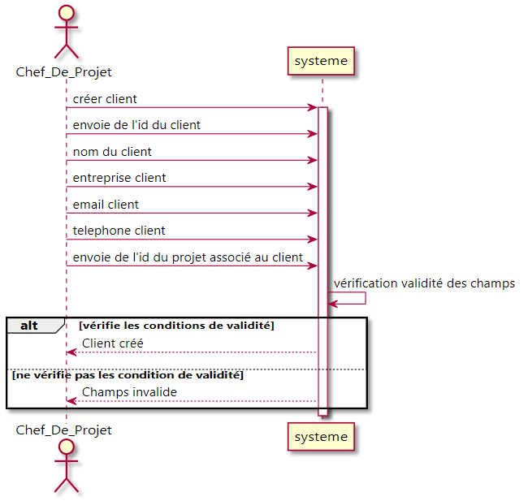
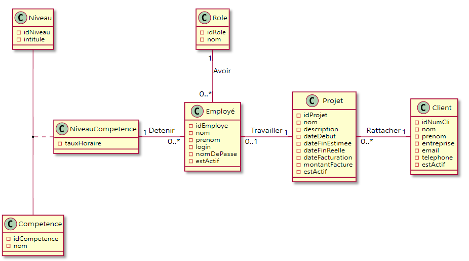

= *Cahier de charges - v1*
:toc: macro
:toc-title: Sommaire
:numbered:
:icons: font

image:https://github.com/vovcdan/test-PTUT/blob/master/doc/logoIUT.png[IUT]

:company: RHESN

Membres : _DUFRECHOU Florian, ONEDA Mathis, SEBAICI Kelian, VOVC Dan-Gabriel, ZHU Xuxin_

toc::[]

== Présentation de l’entreprise

La société « DevExpert » est une Entreprise de Services Numériques (ESN ou encore SSII) qui fournit des prestations de développement d’applications informatiques pour ses clients. L’activité de l’entreprise repose sur des chefs de projet qui gèrent les projets des clients et d’un certain nombre d’employés salariés (analystes, concepteurs, développeurs, testeurs, designers, ergonomes, pentesters, webmaster, etc.) affectés sur les projets à réaliser.

== Présentation du projet

L’entreprise souhaite développer une application Java-Swing-Oracle de gestion des ressources humaines permettant aux chefs de projet qui gèrent l’ensemble des projets et clients de disposer d’un suivi des projets (prévisionnels, en cours et finalisés) et d’un état de la mobilisation des ressources humaines de l’entreprise (cartographie des affectations des salariés par projet).

== Besoins fonctionnels

L’application créée dans le but de l’entreprise est de pouvoir permettre aux chefs de projet d’ajouter des nouveaux clients et employés dans la base de données. Les chefs de projet peuvent ensuite consulter et modifier les informations de n’importe quel client
(son id, son nom, sa date de naissance, son contrat etc.). En plus, il peut aussi rendre inactif un client (on les garde en mémoire dans la base) afin de garder une trace de clients antécédents pour des RH mobilisées sur des projets achevés.

L’application donne accès ensuite aussi au fait d’ajouter un projet (nom du projet, date de début, client référentiel etc.) dans la base de données. Le chef de projet peut ensuite consulter n’importe quel projet de l’entreprise, peu importe les projets qu’il pilote. Pourtant, il peut seulement modifier les projets dont il a été désigné. Ensuite, le chef de projet peut rendre inactif un projet afin de garder en mémoire tous les projets finis.

== Objectifs du logiciel

L’objectif du logiciel est de rendre plus facile aux chefs de projet de gérer ses clients et ses employés de l’entreprise. Ils peuvent créer des projets et les attribuer aux employés pour les développer. Les chefs de projets peuvent ensuite suivre les avancements des projets dirigés par les employés.

== Analyse de l’existant

=== Diagramme de séquence "Créer un projet”

Réalisation d’une diagramme de séquence qui permet au acteur chef de projet de créer un projet dans le système en donnant comme informations l’id du projet, le nom du projet, la description du projet, la date début du projet, la date fin estimée du projet, la date fin réelle maximale du projet, et l’envoie de l’id d’un Client référant à ce projet (on garde le champs null si aucun client n’appartient au projet). Le système vérifie les conditions de validité de tous les champs insérés par le chef de projet. Dans le cas ou il n’y a pas d’erreur, le système confirme l’inscription du nouveau projet, sinon, le système demande de corriger les erreurs.

image:Diagrammes_sequence-v1/UC_creer_projet_img.png[UC_creer_projet]

=== Diagramme de séquence "Créer un client”

Réalisation d’une diagramme de séquence qui permet au acteur chef de projet de créer un nouveau client dans le système en donnant comme informations l’id du client, le nom du client,, l’adresse email du client, le téléphone du client, l’entreprise du client, l’envoie de l’id du d’un projet référant à ce client (on garde le champs null si aucun projet n’appartient au client). Le système vérifie les conditions de validité de tous les champs insérés par le chef de projet. Dans le cas où il n’y a pas d’erreur, le système confirme l’inscription du nouveau client, sinon, le système demande de corriger les erreurs.

=== Diagramme de classes de l’application

Réalisation de la classe de diagramme de l’application créée. La diagramme comporte les classes Niveau, Compétence, Role, Employé, Projet, Client avec une classe d’association Niveau Compétence. Chaque classe comporte des attributs spécifiques. Chaque projet est rattaché à un client et vice-versa, chaque employé travaille sur un projet avec l'employé ayant un rôle. Chaque Employé détient un niveau de compétence qui est associé à un niveau et compétence spécifique.

=== Diagramme de cas d’utilisation de l’application

Réalisation de cas d’utilisation de l’application avec un acteur Chef_De_Projet qui lui permet de gérer les employés (Créer, Lire, Modifier, Inactiver), gérer les clients (Créer, Lire, Modifier) et gérer les projets (Créer, Lire, Modifier).

image:Diagramme_cas_utilisation-v1/diagrammeUC-v1-png.png[UC]

== Analyse des contraintes

=== Contraintes Organisationnelles

Le projet débute le 25 Mai 2021 à 9:30 et se termine le 4 Juin 2021. Nous répartissons le temps en 9h de présentiel et 15h de distanciel pour un temps total de travail de 24h. Nous avons aussi des contraintes de dépôt chaque jour.

=== Contraintes fonctionnelles

Pour réaliser ce projet, nous utilisons une base de données sous Oracle. Nous utilisons différentes procédures PL/SQL. Enfin, l'application sera disponible sous un .jar exécutable. Il est donc nécessaire de posséder une version supérieure ou équivalente à la version 1.8 de java.
